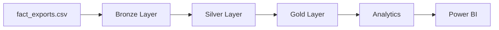
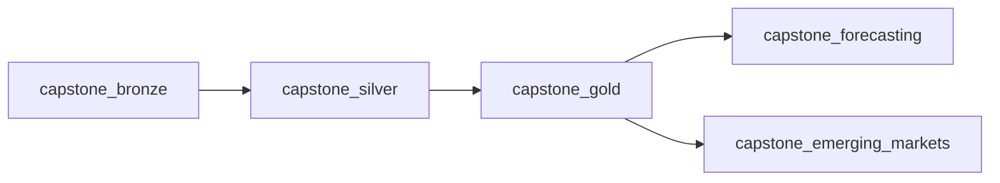

# Global Trade Analytics Platform - Capstone Project

[](https://airflow.apache.org/)
[](https://databricks.com/)
[](https://powerbi.microsoft.com/)

> An end-to-end data engineering project implementing a Bronze-Silver-Gold medallion architecture for global export data analysis, with automated ETL pipeline orchestration and business intelligence dashboards.

---

## Table of Contents

- [Project Overview](#1-project-overview)
- [Business Problem](#2-business-problem)
- [Solution Architecture](#3-solution-architecture)
- [Technology Stack](#4-technology-stack)
- [Data Architecture](#5-data-architecture-bronzeservergold)
- [Databricks Notebooks](#6-databricks-notebooks)
- [Airflow Orchestration](#7-airflow-workflow-orchestration)
- [Data Validation](#8-data-validation--quality-checks)
- [Visualization](#9-visualization--reporting-power-bi)
- [Business Insights](#10-key-business-insights)
- [Testing](#11-testing--validation)
- [Limitations & Future Work](#12-limitations--future-enhancements)
- [Repository Structure](#13-repository-structure)
- [Getting Started](#14-getting-started)
- [Acknowledgements](#15-acknowledgements)

---

## 1. Project Overview

This capstone project demonstrates a complete data engineering pipeline for analyzing global export data. The implementation follows the medallion architecture pattern (Bronze-Silver-Gold) and includes:

- **Data Source**: Export transactions dataset with 7,982 records containing country, product, year, and export metrics
- **Processing Framework**: PySpark on Databricks for distributed data processing
- **Orchestration**: Apache Airflow DAG for automated pipeline execution
- **Analytics**: Export forecasting (2025-2027) and emerging market identification
- **Visualization**: Power BI dashboard for interactive business intelligence

### Key Features

- **Bronze-Silver-Gold Architecture** - Structured data lake implementation with clear separation of raw, cleaned, and aggregated data
- **Data Quality Validation** - Price range validation by product category to ensure data integrity
- **Automated Workflow** - Daily scheduled pipeline execution via Apache Airflow
- **Predictive Analytics** - CAGR-based forecasting for future export trends
- **Market Intelligence** - Multi-factor scoring system for emerging market detection
- **Interactive Dashboards** - Power BI visualizations for stakeholder insights

---

## 2. Data Schema

### Source Data (`fact_exports.csv`)

The raw export data contains the following fields:

| Field | Type | Description |
|-------|------|-------------|
| `export_id` | Integer | Unique identifier for each export transaction |
| `country_code` | String | ISO country code (e.g., USA, CHN, GBR) |
| `country_name` | String | Full country name |
| `region` | String | Geographic region (e.g., North America, Asia, Europe) |
| `product_code` | String | Product category code (AGR, TXT, ELE, AUT, PHA, OIL, MAC) |
| `product_name` | String | Product category name |
| `year` | Integer | Export year (2015-2024) |
| `export_quantity` | Integer | Quantity of goods exported |
| `export_value_usd` | Decimal | Total export value in USD |
| `unit_price` | Decimal | Price per unit in USD |

### Product Categories

The dataset includes seven product categories with specific price validation ranges:

- **AGR (Agriculture)**: $100 - $2,000 per unit
- **TXT (Textiles)**: $200 - $5,000 per unit
- **ELE (Electronics)**: $500 - $20,000 per unit
- **AUT (Automotive)**: $10,000 - $80,000 per unit
- **PHA (Pharmaceuticals)**: $20,000 - $200,000 per unit
- **OIL (Oil & Gas)**: $20,000 - $120,000 per unit
- **MAC (Machinery)**: $5,000 - $50,000 per unit

---

## 3. Architecture

### Medallion Architecture Implementation

The project implements a three-tier data lake architecture using Delta Lake format on Databricks:



### Data Flow

1. **Bronze Layer** (`bronze_exports`)
   - Direct ingestion from `fact_exports.csv`
   - No transformations applied
   - Preserves raw data in original format
   - Table: `workspace.default.bronze_exports`

2. **Silver Layer** (`silver_exports`)
   - Price validation by product category
   - Data standardization (capitalize country and region names)
   - Invalid records filtered out
   - Table: `workspace.default.silver_exports`

3. **Gold Layer** (Aggregations)
   - `gold_country_year`: Country-level metrics by year
   - `gold_product_year`: Product-level metrics by year
   - `gold_region_year`: Regional export values by year

4. **Analytics Layer**
   - `gold_country_forecast`: 3-year export forecasts (2025-2027)
   - `gold_emerging_markets`: Market scoring and rankings

---

## 4. Technology Stack

### Core Technologies

| Component | Technology | Purpose |
|-----------|-----------|---------|
| **Data Processing** | PySpark, Databricks | Distributed data processing and transformations |
| **Storage Format** | Delta Lake | ACID transactions and time travel capabilities |
| **Workflow Orchestration** | Apache Airflow 2.x | DAG scheduling and task dependency management |
| **Visualization** | Power BI Desktop | Interactive business intelligence dashboards |
| **Data Storage** | CSV (raw), Delta Tables (processed) | Source and processed data persistence |

### Python Libraries Used

- `pyspark.sql.functions`: Data transformations (sum, avg, min, max, pow, initcap, when, col)
- `airflow.operators.python`: Python task execution in DAGs
- Delta Lake APIs for table read/write operations

---

## 5. Pipeline Implementation

### Bronze Layer - Raw Data Ingestion

**Notebook**: `capstone_bronze.ipynb`

**Operations**:
- Reads source data from `workspace.default.fact_exports` table
- Creates `bronze_exports` table with identical schema
- No transformations or validations applied

```python
df_bronze = spark.read.table("workspace.default.fact_exports")
df_bronze.write.saveAsTable("workspace.default.bronze_exports")
```

### Silver Layer - Data Cleaning & Validation

**Notebook**: `capstone_silver.ipynb`

**Operations**:
1. **Price Validation**: Filters records based on product-specific unit price ranges
2. **Name Standardization**: Capitalizes country names, regions, and product names using `initcap()`
3. **Data Quality**: Removes invalid price records using conditional logic

**Validation Logic**:
```python
# Price validation by product category
valid_price = when((col("product_code") == "AGR") & col("unit_price").between(100, 2000), 1)
             .when((col("product_code") == "TXT") & col("unit_price").between(200, 5000), 1)
             # ... additional product validations
             .otherwise(0)

df_silver = df.filter(col("valid_price") == 1)
```

**Output**: `workspace.default.silver_exports` (Delta format)

### Gold Layer - Aggregations & KPIs

**Notebook**: `capstone_gold.ipynb`

**Three aggregation tables created**:

1. **Country-Year Aggregation** (`gold_country_year`)
   - Groups by: `country_code`, `country_name`, `region`, `year`
   - Metrics: `total_quantity`, `total_value_usd`, `avg_unit_price`

2. **Product-Year Aggregation** (`gold_product_year`)
   - Groups by: `product_code`, `product_name`, `year`
   - Metrics: `total_quantity`, `total_value_usd`

3. **Region-Year Aggregation** (`gold_region_year`)
   - Groups by: `region`, `year`
   - Metrics: `total_value_usd`

All tables stored in Delta format for ACID compliance and query performance.

### Analytics Layer

#### Export Forecasting (`capstone_forcasting.ipynb`)

**Methodology**: CAGR (Compound Annual Growth Rate) based forecasting

**Process**:
1. Extracts historical data (2018-2024) from `gold_country_year`
2. Calculates CAGR for each country: `(end_value / start_value)^(1/num_years) - 1`
3. Projects future values for 2025, 2026, 2027 using: `end_value * (1 + CAGR)^years`
4. Combines actual and forecasted data

**Formula**:
```python
cagr = pow(end_value / start_value, 1 / num_years) - 1
forecast_value = end_value * pow(1 + cagr, forecast_year - end_year)
```

**Output**: `workspace.default.gold_country_forecast`

#### Emerging Markets Detection (`capstone_emerging_markets.ipynb`)

**Multi-factor scoring system** based on:

1. **Growth Rate (50% weight)**: 3-year CAGR (2021-2024)
2. **Market Size (30% weight)**: Average export value < $200B
3. **Stability (20% weight)**: Low volatility (stddev < $50B)

**Scoring Logic**:
```python
emerging_score = (cagr_3y * 0.5) +
                 (0.3 if avg_export_value < 2e11 else 0) +
                 (0.2 if volatility < 5e10 else 0)
```

**Metrics Calculated**:
- `cagr_3y`: Recent growth trend
- `avg_export_value`: Market size indicator
- `volatility`: Standard deviation of exports
- `emerging_score`: Composite ranking score

**Output**: `workspace.default.gold_emerging_markets` (ranked by score)

---

## 6. Databricks Notebooks

### Notebook Summary

| # | Notebook | Layer | Purpose | Output Table |
|---|----------|-------|---------|--------------|
| 1 | `capstone_bronze.ipynb` | Bronze | Raw data ingestion | `bronze_exports` |
| 2 | `capstone_silver.ipynb` | Silver | Data cleaning and validation | `silver_exports` |
| 3 | `capstone_gold.ipynb` | Gold | Multi-dimensional aggregations | `gold_country_year`<br>`gold_product_year`<br>`gold_region_year` |
| 4 | `capstone_forcasting.ipynb` | Analytics | CAGR-based export forecasting | `gold_country_forecast` |
| 5 | `capstone_emerging_markets.ipynb` | Analytics | Emerging market scoring | `gold_emerging_markets` |

All notebooks execute PySpark transformations and write results to Delta tables in the `workspace.default` schema.

---

## 7. Airflow Workflow Orchestration

### DAG Configuration

**File**: `airflow_project/dags/global_trade_etl.py`

**DAG Name**: `global_trade_pipeline`

**Configuration**:
- **Schedule**: `@daily` (runs once per day)
- **Start Date**: January 1, 2026
- **Catchup**: Disabled (False)
- **Retries**: 1 attempt per task
- **Executor**: SequentialExecutor (configured in `airflow.cfg`)

### Task Dependencies

The DAG consists of 5 PythonOperators with sequential and parallel execution:



**Task Flow**:
```
captone_bronze → capstone_silver → capstone_gold → [capstone_forecasting, capstone_emerging_markets]
```

**Implementation**:
```python
t1 = PythonOperator(task_id='captone_bronze', python_callable=bronze_ingestion)
t2 = PythonOperator(task_id='capstone_silver', python_callable=silver_cleaning)
t3 = PythonOperator(task_id='capstone_gold', python_callable=gold_kpis)
t4 = PythonOperator(task_id='capstone_forecasting', python_callable=forecasting)
t5 = PythonOperator(task_id='capstone_emerging_markets', python_callable=emerging_markets)

t1 >> t2 >> t3 >> [t4, t5]  # Task dependencies
```

**Note**: The current implementation uses placeholder functions. In production, these would invoke Databricks notebook jobs via Databricks API or DatabricksSubmitRunOperator.

---

## 8. Data Quality & Validation

### Implemented Validation Rules

**Silver Layer Validation**:
- **Price Range Checks**: Product-specific unit price validation (7 product categories)
- **Data Type Integrity**: Ensures numeric fields contain valid values
- **Record Filtering**: Invalid records excluded from downstream processing

**Validation Coverage**:
```python
Product     | Min Price | Max Price | Validation Impact
------------|-----------|-----------|------------------
AGR         | $100      | $2,000    | Filters outliers
TXT         | $200      | $5,000    | Removes anomalies
ELE         | $500      | $20,000   | Quality control
AUT         | $10,000   | $80,000   | Range enforcement
PHA         | $20,000   | $200,000  | Price validation
OIL         | $20,000   | $120,000  | Outlier detection
MAC         | $5,000    | $50,000   | Data integrity
```

**Transformation Validation**:
- Name standardization verification (initcap function)
- Null handling in aggregations
- Delta table ACID compliance

### Data Lineage

- Bronze → Silver: Filtered records with valid prices only
- Silver → Gold: Aggregation consistency checks via groupBy operations
- Gold → Analytics: Historical data coverage (2018-2024 for forecasting)

---

## 9. Power BI Dashboard

**File**: `powerBI/capstonePowerBIFile.pbix`

### Data Sources

The Power BI dashboard connects to the following processed data tables:

- `gold_country_year.csv`: Country-level export trends
- `gold_product_year.csv`: Product category performance
- `gold_region_year.csv`: Regional aggregations
- `gold_country_forecast.csv`: Forecasted exports (2025-2027)
- `gold_emerging_markets.csv`: Market opportunity rankings
- `silver_exports.csv`: Cleaned transaction-level data

### Dashboard Components

The Power BI file is designed to provide interactive visualizations including:

- **Country Analysis**: Export value trends by country and year
- **Product Performance**: Comparative analysis across product categories (AGR, TXT, ELE, AUT, PHA, OIL, MAC)
- **Regional Overview**: Geographic distribution of export values
- **Forecast Visualization**: Historical vs. projected export trends
- **Emerging Markets**: Ranked opportunities based on growth and stability metrics

### Refresh Strategy

Data can be refreshed by:
1. Re-exporting Delta tables to CSV format in `data/processed/` folder
2. Refreshing data connections in Power BI Desktop
3. Publishing updated report to Power BI Service (if applicable)

---

## 10. Project Structure

```
capstone/
├── airflow_project/                    # Airflow orchestration environment
│   ├── airflow.cfg                     # Airflow configuration
│   ├── airflow.db                      # SQLite metadata database
│   ├── airflow-webserver.pid          # Webserver process ID
│   ├── webserver_config.py            # Webserver settings
│   ├── .gitignore                     # Git ignore rules
│   ├── dags/                          # DAG definitions
│   │   ├── global_trade_etl.py       # Main pipeline DAG
│   │   └── __pycache__/              # Python bytecode cache
│   ├── logs/                          # Airflow execution logs
│   └── airflow_env/                   # Python virtual environment
│       └── (virtual environment files)
│
├── data/                              # Data storage
│   ├── raw/                          # Source data
│   │   └── fact_exports.csv         # 7,982 export records
│   └── processed/                    # Transformed data
│       ├── silver_exports.csv       # Cleaned data
│       ├── gold_country_year.csv    # Country aggregations
│       ├── gold_product_year.csv    # Product aggregations
│       ├── gold_region_year.csv     # Regional aggregations
│       ├── gold_country_forecast.csv # Forecast data
│       └── gold_emerging_markets.csv # Market rankings
│
├── databricks notebooks/              # PySpark processing notebooks
│   ├── capstone_bronze.ipynb         # Raw ingestion
│   ├── capstone_silver.ipynb         # Data cleaning
│   ├── capstone_gold.ipynb           # Aggregations
│   ├── capstone_forcasting.ipynb     # Export forecasting
│   └── capstone_emerging_markets.ipynb # Market detection
│
├── powerBI/                           # Business intelligence
│   └── capstonePowerBIFile.pbix      # Dashboard file
│
└── README.md                          # This file
```

---

## 11. Setup & Execution

### Prerequisites

- **Databricks Workspace**: For running PySpark notebooks
- **Apache Airflow**: Version 2.x or higher
- **Power BI Desktop**: For viewing dashboard file
- **Python**: 3.8+ (for Airflow environment)

### Airflow Setup

The Airflow environment is pre-configured in the `airflow_project` folder:

#### 1. Activate Airflow Environment

**Linux/Mac**:
```bash
cd capstone/airflow_project
source airflow_env/bin/activate
```

**Windows PowerShell**:
```powershell
cd capstone\airflow_project
.\airflow_env\Scripts\Activate.ps1
```

#### 2. Set Airflow Home

**Linux/Mac**:
```bash
export AIRFLOW_HOME=$(pwd)
```

**Windows PowerShell**:
```powershell
$env:AIRFLOW_HOME = (Get-Location).Path
```

#### 3. Start Airflow Services

```bash
# Terminal 1: Start the webserver
airflow webserver --port 8080

# Terminal 2: Start the scheduler
airflow scheduler
```

#### 4. Access Airflow UI

Open browser: `http://localhost:8080`

The DAG `global_trade_pipeline` will be visible in the UI.

### Databricks Execution

#### Method 1: Manual Notebook Execution

1. Upload notebooks from `databricks notebooks/` to your Databricks workspace
2. Ensure source data is loaded into `workspace.default.fact_exports` table
3. Execute notebooks in order:
   - `capstone_bronze.ipynb`
   - `capstone_silver.ipynb`
   - `capstone_gold.ipynb`
   - `capstone_forcasting.ipynb`
   - `capstone_emerging_markets.ipynb`

#### Method 2: Airflow Integration (Production)

To enable Databricks job triggering from Airflow:

1. Install Databricks provider:
   ```bash
   pip install apache-airflow-providers-databricks
   ```

2. Update DAG functions to use `DatabricksSubmitRunOperator`

3. Configure Databricks connection in Airflow:
   - Connection ID: `databricks_default`
   - Host: Your Databricks workspace URL
   - Token: Personal access token

### Data Export

To export Delta tables for Power BI:

```python
# In Databricks notebook
spark.read.table("workspace.default.silver_exports") \
    .coalesce(1) \
    .write.csv("dbfs:/FileStore/exports/silver_exports.csv", header=True)
```

Download CSVs to `data/processed/` folder.

---

## 12. Key Analytics Insights

### Export Forecasting Methodology

The forecasting notebook uses CAGR (Compound Annual Growth Rate) to project future export values:

**Historical Period**: 2018-2024 (7 years)  
**Forecast Period**: 2025-2027 (3 years)

**CAGR Calculation**:
```
CAGR = (Ending Value / Beginning Value)^(1/Number of Years) - 1
```

**Forecast Formula**:
```
Forecast Value = Last Known Value × (1 + CAGR)^Years Ahead
```

This approach provides country-level export projections based on historical growth patterns.

### Emerging Markets Scoring

Markets are ranked using a composite score based on three factors:

| Factor | Weight | Criteria | Reasoning |
|--------|--------|----------|-----------|
| **Growth Rate** | 50% | 3-year CAGR (2021-2024) | Recent momentum indicator |
| **Market Size** | 30% | Avg exports < $200B | Identifies growth opportunities |
| **Stability** | 20% | Volatility < $50B | Reduces investment risk |

**Scoring Formula**:
```
Emerging Score = (CAGR × 0.5) + 
                 (0.3 if small market) + 
                 (0.2 if low volatility)
```

Countries with higher composite scores represent better emerging market opportunities combining growth, size, and stability characteristics.

### Aggregation Insights

The gold layer provides three analytical perspectives:

1. **Country-Year**: Enables time-series analysis of individual country performance
2. **Product-Year**: Identifies trending product categories and seasonal patterns
3. **Region-Year**: Facilitates geographic comparison and regional strategy

---

## 13. Implementation Notes

### Current State

This project demonstrates a complete data engineering pipeline with the following characteristics:

**Implemented Features**:
- ✓ Bronze-Silver-Gold medallion architecture
- ✓ PySpark transformations on Databricks
- ✓ Data quality validation (price range checks)
- ✓ Multi-dimensional aggregations
- ✓ CAGR-based forecasting
- ✓ Emerging market detection algorithm
- ✓ Airflow DAG structure and dependencies
- ✓ Power BI dashboard file

**Integration Status**:
- Airflow DAG uses placeholder functions (not live Databricks integration)
- Databricks tables stored in `workspace.default` schema
- Delta Lake format used for all processed tables
- CSV exports available in `data/processed/` for Power BI consumption

### Data Processing Summary

**Dataset**: 7,982 export transaction records

**Processing Layers**:
1. Bronze: Raw data preservation
2. Silver: Price validation and standardization
3. Gold: Three aggregation tables (country, product, region)
4. Analytics: Forecast table + emerging markets table

**Output Artifacts**:
- 5 Delta tables in Databricks
- 6 CSV files for visualization
- 1 Power BI dashboard
- 1 Airflow DAG

### Future Enhancements

**Production Readiness**:
- Replace Airflow placeholder functions with `DatabricksSubmitRunOperator`
- Implement actual job_id references for Databricks jobs
- Add error handling and retry logic
- Implement data quality monitoring and alerts

**Technical Improvements**:
- Migrate to cloud storage (S3/ADLS/GCS)
- Implement incremental processing instead of full refreshes
- Add ML-based forecasting (Prophet, ARIMA) beyond CAGR
- Create REST API for programmatic access
- Add automated testing for transformations

**Analytics Expansion**:
- Add seasonal decomposition analysis
- Implement anomaly detection
- Create customer segmentation
- Build predictive models for trade relationships

---

## 14. Getting Started

### Prerequisites

- Python 3.10+
- Apache Airflow
- Databricks workspace (or local Spark for testing)
- Power BI (for dashboards)

### Installation Steps

#### 1. Clone the Repository
```bash
git clone <repo_url>
cd capstone
```

#### 2. Set Up Python Environment
```bash
python -m venv airflow_env

# Linux/Mac
source airflow_env/bin/activate

# Windows
.\airflow_env\Scripts\activate
```

#### 3. Install Dependencies
```bash
pip install -r requirements.txt
```

#### 4. Configure Airflow
```bash
# Linux/Mac
export AIRFLOW_HOME=$(pwd)/airflow_project

# Windows PowerShell
$env:AIRFLOW_HOME="$(Get-Location)\airflow_project"
```

#### 5. Initialize Airflow Database
```bash
airflow db init
```

#### 6. Start Airflow Services
```bash
# Terminal 1: Start webserver
airflow webserver --port 8080

# Terminal 2: Start scheduler
airflow scheduler
```

#### 7. Access Airflow UI
Open your browser and navigate to: `http://localhost:8080`

### Quick Start Guide

**For Databricks Notebooks**:
1. Upload notebooks from `databricks notebooks/` to Databricks workspace
2. Ensure `fact_exports.csv` is loaded into `workspace.default.fact_exports` table
3. Execute notebooks sequentially: bronze → silver → gold → forecasting, emerging_markets
4. Verify Delta tables created in `workspace.default` schema

**For Airflow**:
1. Navigate to `capstone/airflow_project`
2. The Airflow environment is already configured
3. Start Airflow webserver and scheduler (see instructions above)
4. View `global_trade_pipeline` DAG in UI at `http://localhost:8080`

**For Power BI**:
1. Open `powerBI/capstonePowerBIFile.pbix` in Power BI Desktop
2. Refresh data connections to `data/processed/` CSV files
3. Explore visualizations and create custom reports

---

## 15. Technical Specifications

### Databricks Configuration

- **Cluster Type**: All-purpose or job cluster
- **Databricks Runtime**: 13.x LTS or higher (with Delta Lake support)
- **Spark Version**: 3.4+
- **Instance Type**: Standard_DS3_v2 or equivalent (development)
- **Python Version**: 3.9+

### Delta Tables Created

| Table Name | Schema | Row Count (Approx) |
|------------|--------|-------------------|
| `bronze_exports` | workspace.default | 7,982 |
| `silver_exports` | workspace.default | ~7,500 (post-validation) |
| `gold_country_year` | workspace.default | Aggregated by country-year |
| `gold_product_year` | workspace.default | Aggregated by product-year |
| `gold_region_year` | workspace.default | Aggregated by region-year |
| `gold_country_forecast` | workspace.default | Historical + 3-year forecast |
| `gold_emerging_markets` | workspace.default | Market rankings |

### Airflow Configuration

- **Executor**: SequentialExecutor (local development)
- **Database**: SQLite (airflow.db)
- **DAGs Folder**: `/mnt/e/Chubb-Assignments/capstone/airflow_project/dags`
- **Logs Folder**: `airflow_project/logs`
- **Timezone**: UTC

---

## 16. Acknowledgements

This capstone project demonstrates practical application of:

- **Data Engineering Patterns**: Medallion architecture implementation
- **Big Data Processing**: PySpark and Delta Lake on Databricks
- **Workflow Orchestration**: Apache Airflow DAG design
- **Business Intelligence**: Power BI dashboard development
- **Analytical Techniques**: CAGR forecasting and composite scoring systems

**Technologies**: Databricks, Apache Airflow, PySpark, Delta Lake, Power BI

---

## License

This project is created for educational and portfolio demonstration purposes.

---

**Author**: Data Engineering Capstone Project  
**Last Updated**: January 2026